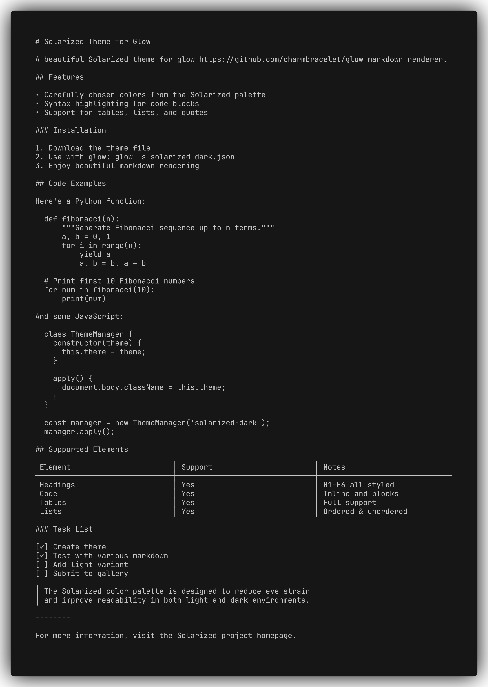

# Solarized Theme for Glow

[Solarized](https://ethanschoonover.com/solarized/) Dark and Light themes for [glow](https://github.com/charmbracelet/glow) and [glamour](https://github.com/charmbracelet/glamour).



## Installation

1. Download the theme file:
   - [solarized-dark.json](solarized-dark.json) for Solarized Dark
   - [solarized-light.json](solarized-light.json) for Solarized Light

2. Place it in your preferred location (e.g., `~/.config/glow/`)

3. Use with glow:
   ```bash
   glow -s ./solarized-dark.json README.md
   ```

   Or set as default in `~/.config/glow/glow.yml`:
   ```yaml
   style: "~/.config/glow/solarized-dark.json"
   ```

## License

MIT
